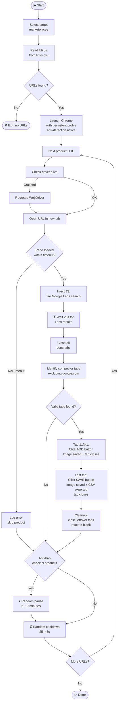

# 🕷️ Automated Competitor Price Crawler
### Selenium + Google Lens + Anti-Detection

> A headless-style web crawler that reads a list of product URLs from CSV, navigates each one using a persistent Chrome profile, triggers a Google Lens visual search via injected Tampermonkey JavaScript, collects competitor listings across major marketplaces, and exports structured data — all with built-in anti-detection and anti-ban mechanisms.


---

## 📋 Table of Contents

- [How It Works](#-how-it-works)
- [Flowchart](#-flowchart)
- [Prerequisites](#-prerequisites)
- [Installation](#-installation)
- [Preparing the CSV](#-preparing-the-csv)
- [Running the Crawler](#-running-the-crawler)
- [Marketplace Selection](#-marketplace-selection)
- [Configuration](#%EF%B8%8F-configuration)
- [Anti-Detection Features](#-anti-detection-features)
- [Error Handling](#-error-handling)
- [Output](#-output)

---

## ⚙️ How It Works

Unlike traditional scrapers that rely on static HTML parsing, this crawler operates through **real browser automation** — it controls an actual Chrome instance, making it resilient to JavaScript-heavy sites and anti-scraping measures:

1. **Reads** a list of product URLs from `links.csv`
2. **Launches** Chrome with a persistent user profile and automation detection masked
3. For each product URL:
   - Opens the URL in a new tab
   - Triggers a Google Lens reverse image search via injected JavaScript (`window.__tm_lens.start()`)
   - Waits for Lens results to populate
   - Closes all Lens tabs
   - **Processes competitor tabs**: clicks "Add" on each (saves image + registers to queue) and "Save" on the last (exports CSV)
   - Cleans up all tabs and applies a randomized cooldown
4. **Anti-ban pauses** trigger automatically every N products (randomized interval)
5. **Crash recovery**: automatically recreates the WebDriver if the browser session is lost

---

## 🔀 Flowchart



---

## 🛠️ Prerequisites

| Requirement | Details |
|---|---|
| **OS** | Windows 10/11 |
| **Browser** | Google Chrome (latest) |
| **Python** | 3.8 or higher |
| **Tampermonkey** | Chrome extension — scripts must be installed |
| **links.csv** | CSV file with product URLs (one per line) |

---

## 📦 Installation

### 1. Clone the repository

```bash
git clone https://github.com/Gabrielbenin/WebScraperSelenium.git
cd WebScraperSelenium
```

### 2. Install Python dependencies

```bash
pip install -r requirements.txt.txt
```

Or install manually:

```bash
pip install selenium webdriver-manager
```

> **ChromeDriver is installed automatically** via `webdriver-manager` — no manual download needed.

---

## 📄 Preparing the CSV

Create a `links.csv` file in the project folder. Each row should contain one product URL:

```csv
https://www.amazon.com.br/dp/B09XYZ123
https://www.mercadolivre.com.br/p/MLB12345678
https://www.magazineluiza.com.br/produto/12345/
```

> Only lines starting with `http` are read. Empty lines and headers are ignored automatically.

---

## ▶️ Running the Crawler

### Option A — Python directly

```bash
python automacao_selenium.py
```

### Option B — Launcher script

```bash
iniciar.bat
```

### Startup flow

1. The script asks you to **select target marketplaces** (enter numbers separated by commas)
2. It shows the total number of product URLs found
3. Press **ENTER** to start
4. Chrome opens automatically with the bot profile
5. The crawler runs unattended until all URLs are processed

---

## 🛒 Marketplace Selection

At startup, you'll see:

```
Choose target competitor sites (numbers separated by comma):
  1 - mercadolivre
  2 - casasbahia
  3 - leroymerlin
  4 - americanas
  5 - amazon.com.br
  6 - magazineluiza
  7 - shopee

Example: 1,3,5 ->
```

Enter the numbers of the marketplaces you want to monitor. If you leave it blank, a default set is used (Mercado Livre, Leroy Merlin, Americanas, Amazon, Magazine Luiza).

---

## ⚙️ Configuration

Edit these constants at the top of `automacao_selenium.py`:

```python
WAIT_PAGE_LOAD   = 10    # Max seconds to wait for product page to load
WAIT_LENS_CLOSE  = 25    # Seconds to wait for Lens results to appear
WAIT_AFTER_INSERT = 6    # Seconds after clicking ADD for image to download
COOLDOWN_MIN     = 25    # Min seconds between products
COOLDOWN_MAX     = 45    # Max seconds between products (randomized)
ANTIBAN_EVERY_MIN = 25   # Min products before anti-ban pause
ANTIBAN_EVERY_MAX = 40   # Max products before anti-ban pause (randomized)
ANTIBAN_MIN      = 360   # Min anti-ban pause duration (seconds)
ANTIBAN_MAX      = 600   # Max anti-ban pause duration (seconds)
```

> **Tip:** Increase `WAIT_LENS_CLOSE` if Google Lens takes longer to load on your connection.

---

## 🛡️ Anti-Detection Features

This crawler is built to avoid bot detection:

| Feature | Implementation |
|---|---|
| **WebDriver flag masked** | `navigator.webdriver` overridden to `undefined` via JS |
| **Automation switches disabled** | `--disable-blink-features=AutomationControlled` |
| **Persistent Chrome profile** | `BotChromeProfile/` — retains cookies, sessions, and extensions |
| **Randomized cooldowns** | Waits between products are randomized within a range |
| **Randomized anti-ban pauses** | Long pauses trigger at random intervals (every 25–40 products) |
| **Human-like tab delays** | Random `0.8–1.2s` delay before interacting with each tab |

---

## 🔧 Error Handling

| Scenario | Behavior |
|---|---|
| Page load timeout | Logs to `erro.log`, skips product, continues |
| 3 consecutive timeouts | Automatically recreates the ChromeDriver |
| Browser window lost | Detects `NoSuchWindowException`, recreates driver |
| Lens tab not found | Skips Lens cleanup, continues to tab processing |
| No competitor tabs | Logs warning, moves to next product |
| Fatal exception | Writes full error to `erro.log`, exits gracefully |

Check `erro.log` for any errors after a run:

```bash
cat erro.log
```

---

## 📁 Output

Results are saved by the Tampermonkey scripts into an `AbasSalvas/` folder:

```
AbasSalvas/
├── IMG_1717000001_042.jpg     ← competitor product images
├── IMG_1717000002_011.webp
├── 9988776.csv                ← CSV report per product
└── Relatorio_Imagens_xxx.csv  ← fallback report (when no ID found)
```

### CSV Format

```
Page URL ; Image URL ; Saved File Name ; Product ID
https://mercadolivre.com.br/... ; https://http2.mlstatic.com/... ; IMG_xxx.jpg ; 9988776
https://amazon.com.br/... ; https://m.media-amazon.com/... ; IMG_xxx.webp ; 9988776
```

---

## 📄 License

MIT — free to use, modify and distribute.
